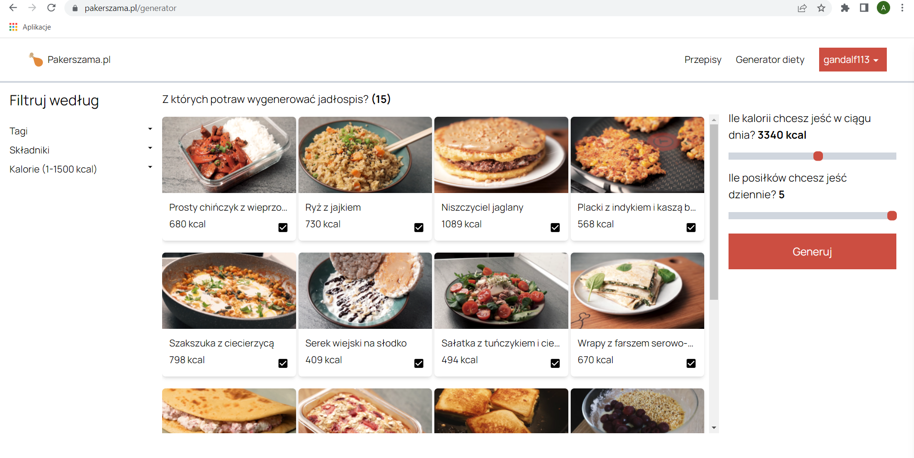

# portfolio

<h4>Uwaga! Większość repozytoriów jest prywatna. Powinieneś mieć na mailu zaproszenie do dołączenia jako collaborator</h4>
<h3>1. React/Python - aplikacja webowa 
Dostępna pod adresem: https://pakerszama.pl/</h3>
https://github.com/gandalf113/recipely-api [PRYWATNE] 
https://github.com/gandalf113/recipely-client [PRYWATNE] 

<h3>2. React/Electron - aplikacja desktopowa </h3>
https://github.com/gandalf113/komis-olus-desktop2

<h3>3. Flutter - aplikacja mobilna  
Do pobrania: https://play.google.com/store/apps/details?id=com.lift_analyst&hl=pl&gl=US
</h3>
https://github.com/gandalf113/Lift-Tracker [PRYWATNE] 

<h3>4. Java - aplikacja desktopowa </h3>
https://github.com/gandalf113/Automator-ODS  
